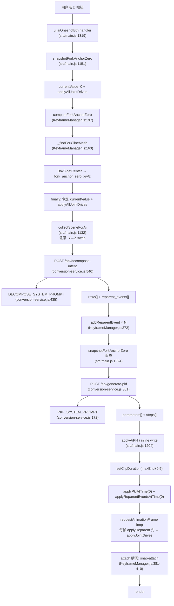
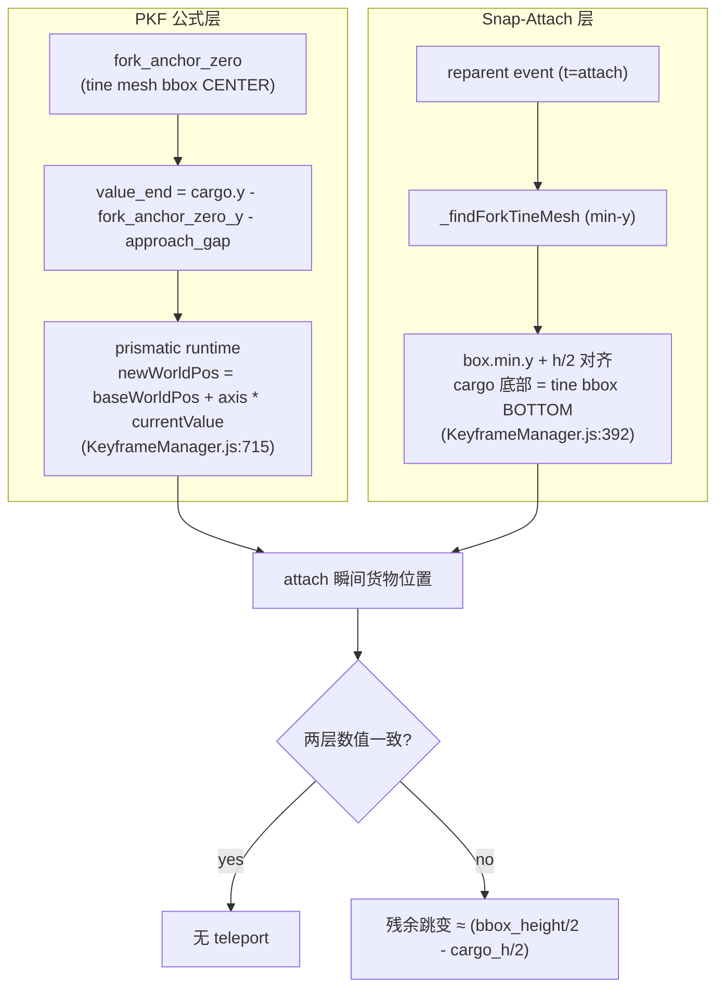
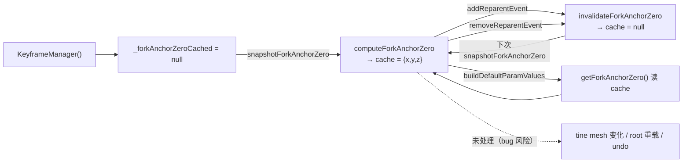

# 叉车取放货模型（领域文档）

> 这篇文档是 v14.1 🚀 一键生成机制的**领域模型契约**：管线图 / 核心抽象 / 运行时假设 / schema / cache 生命周期 / 失效矩阵。接入新模型前必读。
>
> **Review 性质的内容（代码气味 / bug finding / 优先级 / 推荐行动）已移到 [docs/REVIEW-v14.md](../REVIEW-v14.md)**。本文档只保留领域知识。
>
> **谁应该读**：
>
> - 接入**新模型**（侧叉、磁爪、机械臂、双货叉……）前 — 读 [域假设](#域假设清单带代码引用) + [失效矩阵](#失效矩阵什么模型会崩哪里)
> - 审 schema 演化 — 读 [schema 与序列化](#schema-与序列化)
> - 理解 cache 生命周期 — 读 [Cache 生命周期总览](#cache-生命周期总览)
>
> **不应该读**：如果只想要 v14.1 是什么 → 先看 [README.md](../../README.md)，[CLAUDE.md](../../CLAUDE.md#37) 的 bug #37 / #36。

---

## TL;DR

v14.1 的 🚀 机制由 **四个相互约束的组件** 构成：

1. `fork_anchor_zero` — 叉齿承载点在**关节全零位**时的世界坐标（自动注入 AI prompt）
2. `approach_gap` — 叉齿距货物缓冲（AI 声明的 PKF 参数，default 0）
3. `snap-attach` — attach 瞬间强制把货物对齐到叉齿 bbox 底部
4. `_findForkTineMesh` — 启发式找"叉齿尖 mesh"

**对标准前载叉车工作良好**，整体是 `70% 领域模型 + 30% 启发式 + 10% 历史债务`。非标准形态（倒叉/夹爪/磁爪/侧叉/多货叉）会在不同环节失效，见 [失效矩阵](#失效矩阵什么模型会崩哪里)。

---

## 管线与代码路径总览

**关键顺序**：每帧的 `loop` 里 [`applyReparentEventsAtTime` 必须先于 `applyAllJointDrives`](../../src/main.js#L990-993)（已注释说明）。反过来会导致关节在旧 scene graph 上计算，attach 事件撕裂。

---

## 核心抽象表（精确代码引用）

| 概念 | 是什么 | 代码位置 |
|------|--------|---------|
| `fork_anchor_zero` | 关节全零位时，叉齿**承载点**的世界坐标（UI Z-up） | [KeyframeManager.js:197-220](../../src/core/KeyframeManager.js) |
| `_forkAnchorZeroCached` | 上面的结果缓存，`buildDefaultParamValues` 读它 | [KeyframeManager.js:218 / :227 / :232 / :1325](../../src/core/KeyframeManager.js) |
| `invalidateForkAnchorZero` | reparent event 变更时强制失效 | [KeyframeManager.js:285, 296](../../src/core/KeyframeManager.js) |
| `snapshotForkAnchorZero` | 临时归零 → 调 compute → 恢复（try/finally） | [src/main.js:1151-1167](../../src/main.js) |
| `_findForkTineMesh` | `_CS19110` 子树里 world bbox `min.y` 最小的 mesh = 叉齿尖 | [KeyframeManager.js:163-176](../../src/core/KeyframeManager.js) |
| `approach_gap` | AI 声明的 PKF parameter，default 0 | AI prompt 要求 [conversion-service.js:284](../../tools/conversion-service.js) |
| `snap-attach` | attach 瞬间对齐 cargo 底部到 tine mesh bbox 底部 | [KeyframeManager.js:381-410](../../src/core/KeyframeManager.js) |
| `applyReparentEventsAtTime` | 从 t=0 累积事件 → 切 scene graph parent | [KeyframeManager.js:327-434](../../src/core/KeyframeManager.js) |
| `originalParentMap` + `originalWorldTransforms` | 循环边界复位用 | [KeyframeManager.js:244-263](../../src/core/KeyframeManager.js) |
| `getCargoSizeParams` | 把 cargo marker `size.w/h/d` 注入 PKF 公式 | [KeyframeManager.js:142-151](../../src/core/KeyframeManager.js) |

---

## 双层对齐机制（teleport 的结构性起源）

**结构性问题**：公式层参考 **bbox 中心**（`box.getCenter()`），snap 层参考 **bbox 底部 + cargo.h/2**。数学上这两点差 `bbox_height/2 - cargo_h/2`。`approach_gap=0` 只能让两层的**水平**分量对齐，**垂直**分量的差仍在。

**修复方向**（R1）：两层用同一个参考点。推荐都用 bbox 中心，snap 层改为 `desiredWorldPos = center` 而不是 `(center.x, box.min.y + h/2, center.z)`。改完后 `approach_gap=0` 结构性零跳变。

---

## 域假设清单（带代码引用）

### 几何形态（跟 mesh 结构强耦合）

1. **叉齿方向向下** — [KeyframeManager.js:170](../../src/core/KeyframeManager.js)：`if (box.min.y < bestMinY)`。向上抓取、水平抓取、悬臂吸附都**会选错 mesh**。
2. **接触面朝上** — [KeyframeManager.js:392](../../src/core/KeyframeManager.js)：`box.min.y + h/2`。夹爪（侧面接触）、磁爪（顶面接触）、吊钩（点接触）语义不适用。
3. **货物为立方体** — [KeyframeManager.js:384](../../src/core/KeyframeManager.js)：只取 `markerMeta.size?.h`，单一标量高度。桶 / 卷 / 杆 / 软物无法正确表达。
4. **叉齿整体是一个 joint group** — [KeyframeManager.js:203](../../src/core/KeyframeManager.js)：`sceneRoot.getObjectByName(attachEvent.new_parent_name)` 拿到叉齿对象后，把其**整个子树**扔进 `_findForkTineMesh`。当前模型 `_CS19110` 本身就是 leaf Mesh（子树为空），启发式自然正确；**真有门架/支架子 mesh 时 min-y 恰好能挑对是巧合**。
5. **场景里所有 marker 都通过 name 关联** — [KeyframeManager.js:361-366](../../src/core/KeyframeManager.js) 通过 `sceneMarkers.values()` 找 `meta.name === childName`；导出导入都用 name（见 [gotchas/001-gltf-scene-wrapping-roundtrip](../gotchas/001-gltf-scene-wrapping-roundtrip.md)）。

### 运动约定（跟运动学强耦合）

6. **主接近方向 = UI Y 轴（前后）** — [conversion-service.js:567](../../tools/conversion-service.js) 直接把 `fork_anchor_zero_y` 标注成"主轴：前后方向"，公式 `cargo.y - fork_anchor_zero_y - approach_gap` 硬编码接近轴。侧叉、倒叉、旋转取货都**需要显式重新映射**。
7. **prismatic `currentValue` = 位移（不是绝对坐标）** — [KeyframeManager.js:715](../../src/core/KeyframeManager.js)：`newWorldPos = baseWorldPos.clone().add(worldAxisVec.multiplyScalar(def.currentValue))`。这是 bug #37 的根因：AI 必须被**显式告知**这个语义，否则会把公式当绝对坐标用（见 [AI prompt 健康度](#ai-prompt-健康度问题)）。
8. **承载只发生在 attach 瞬间** — [KeyframeManager.js:373](../../src/core/KeyframeManager.js)：`if (parentChanged)` 才执行 snap 逻辑。attach 后 cargo 纯靠 `Object3D.attach` 保持相对 transform 跟随 — 没有"每帧校正"机制。
9. **detach 没有对偶 snap** — [KeyframeManager.js:381](../../src/core/KeyframeManager.js)：`if (parentChanged && targetParent !== root)`。detach 到世界根时完全依赖 attach 保持语义，cargo 停在叉齿当前位置 → PKF 误差会在 detach 时累积成 cargo 位置错位。
10. **一个 clip 只有一次 anchor-relevant attach** — [KeyframeManager.js:201](../../src/core/KeyframeManager.js)：`events.find((e) => e.new_parent_name)` 取**第一个**非 null attach 事件。多次装卸的第二/第三次 attach 用的还是**第一次的 anchor**。

### 流程约定（跟调用顺序强耦合）

11. **anchor 必须在零位快照** — [src/main.js:1151-1167](../../src/main.js)：没有手动守护，全靠 `snapshotForkAnchorZero` 保证"临时归零→快照→恢复"。直接调 `KeyframeManager.computeForkAnchorZero` 不归零 → 返回的 anchor 被当前驱动态污染。
12. **UI Z-up ↔ Three.js Y-up 手工 swap** — [KeyframeManager.js:214-216](../../src/core/KeyframeManager.js) + [src/main.js:1139-1140](../../src/main.js)：注释"threejs z = UI y(前后)"。任何发给 AI 的坐标都必须 swap（历史上漏做过一次，见 [REVIEW-v14 F1](../REVIEW-v14.md)）。

---

> **Review 性质的内容**（代码气味 8 条 / AI prompt 健康度 5 条 / 诊断盲区 / P0-P2 推荐行动）已移到 [docs/REVIEW-v14.md](../REVIEW-v14.md)。本文档从这里开始是**领域续集**（Schema、Cache 生命周期、失效矩阵）。

---

## Schema 与序列化

### Schema v6 覆盖的数据

- `manifest.json` 有 `schema_version: 6`（[ResultPackageExporter.js:109](../../src/core/ResultPackageExporter.js)）+ `source.root_name`（v5 加的，防 FBX roundtrip 改名 bug #34）
- `motion.json` 的 `clips[].reparent_events[]`（v5）
- `joints.json` 的 `role` 字段（用户设的关节角色，导入时恢复）
- cargo marker 的 `size.w/h/d` 通过 `sceneMarkers` 序列化（v6）

### Schema **不**覆盖的数据

- **`fork_anchor_zero`**：每次 🚀 现场算。导入 ZIP 后没有；L2 需要它就重算。**这是对的** — anchor 依赖当前几何，不依赖历史状态。
- **`approach_gap`**：作为 **PKF parameter** 序列化（用户声明的自定义参数），没有特殊 schema 字段。也是对的。
- **snap-attach 行为**：runtime 行为，不序列化。改 `box.min.y + h/2` 的实现不影响 ZIP 兼容性（R1 改动完全在 runtime）。

### 旧 ZIP roundtrip 兼容性

- v4 ZIP（无 reparent_events + 无 role）→ 导入不崩，clip 自动填 `reparentEvents: []`（[KeyframeManager.js:784](../../src/main.js)），PKF 能跑但走退化路径
- v5 ZIP（有 reparent_events + 无 role）→ role 默认空字符串，AI 退化到 type/axis 猜测（bug #29）
- v6 ZIP（完整）→ v14.1 全功能

**没有前向兼容问题**。未来加 `attachment_anchor` 字段时按 schema v7 处理。

---

## Cache 生命周期总览

**已处理的失效触发**：reparent event 增删。
**未处理的失效触发**：叉齿子树增删 mesh、整场景 reload、undo/redo 跨步撤销 reparent、roundtrip 后重算。

**最后一个尤其要注意**：导入 ZIP 后 `_forkAnchorZeroCached` 被 `restoreState` 重置为 undefined（[KeyframeManager.js:1207-1232](../../src/core/KeyframeManager.js) 的 restoreState 不显式设，但对象重建时新字段默认 undefined） — `getForkAnchorZero()` 的 `|| {}` 兜底保证空对象。空对象让 `buildDefaultParamValues` 里的 `Object.assign` 是 no-op → `fork_anchor_zero_*` 变量在 PKF 公式里**不存在** → `evaluatePkfFormula` 抛 "未定义变量" 错误 → 每帧所有步骤被跳过。

这其实是**已知的静默降级**：roundtrip 后必须**重新点 🚀 生成一次**，否则之前导出的 PKF 公式无法求值。应在 import 后调 `snapshotForkAnchorZero()` 自动把 cache 填回，让导入的 PKF 能直接跑。

**修复**：[src/main.js handleImportPackage](../../src/main.js#L580) 的导入末尾加一次 `snapshotForkAnchorZero()` 调用（在关节两阶段应用之后）。**优先级 P1**。

---

## 失效矩阵：什么模型会崩哪里

| 模型类型 | 假设 1 (向下) | 假设 2 (接触面) | 假设 6 (Y-approach) | 假设 9 (detach snap) | 修复路径 |
|---------|:---:|:---:|:---:|:---:|---|
| 标准前载叉车（当前） | ✅ | ✅ | ✅ | △ | — |
| 倒挂叉车（天花板） | ❌ | ❌ | △ | △ | R4 手动 anchor |
| 侧叉（沿 x 取货） | △ | ✅ | ❌ | △ | R4 + R7 approach_axis |
| 夹爪（侧面夹） | ❌ | ❌ | △ | △ | R4 + 改 snap 语义 |
| 磁力吸附（顶部） | ❌ | ❌ | △ | △ | R4 + 改 snap 语义 |
| 翻斗/倾倒（cargo 非刚性） | △ | △ | ✅ | ❌ | 新方向，当前架构不支持 |
| 旋转取货（先转再插） | △ | △ | ❌ | △ | R7 + R8 config-aware anchor |
| 多叉齿（双货叉平行取两货） | △ | △ | △ | △ | 新 anchor schema，当前 find 只返 1 个 |

图例：✅ OK / △ 有小问题但能跑 / ❌ 必崩

**通用策略**：接新模型前按这 7+1 个假设**逐条核对**，失效的项单独做最小改动。不要用"通用化"冲动一次改 3 处。

---

## 相关文档

**评审 / 行动项**
- [docs/REVIEW-v14.md](../REVIEW-v14.md) — **master review**，包含从本文档移过去的代码气味 / AI prompt 健康度 / 诊断盲区 / P0-P2 推荐行动

**同领域**
- [PKF 参数化关键帧公式](pkf-parametric-keyframe-formula.md)
- [scene-marker-system](scene-marker-system.md)
- [AI pipeline 架构](../architecture/ai-pipeline.md)

**相关 bug 历史**
- [gotchas/006-coordinate-swap-forgotten](../gotchas/006-coordinate-swap-forgotten.md) — Y↔Z swap 漏做的坑
- [CLAUDE.md #37](../../CLAUDE.md) — `fork_offset → fork_anchor_zero` 演化
- [CLAUDE.md #36](../../CLAUDE.md) — `_findForkTineMesh` 启发式的由来
- [CLAUDE.md #34](../../CLAUDE.md) — FBX roundtrip root_name bug
- [CLAUDE.md #35](../../CLAUDE.md) — fixed 关节跟随的一致性修复
- [CLAUDE.md #22](../../CLAUDE.md) — 链式关节两阶段导入
